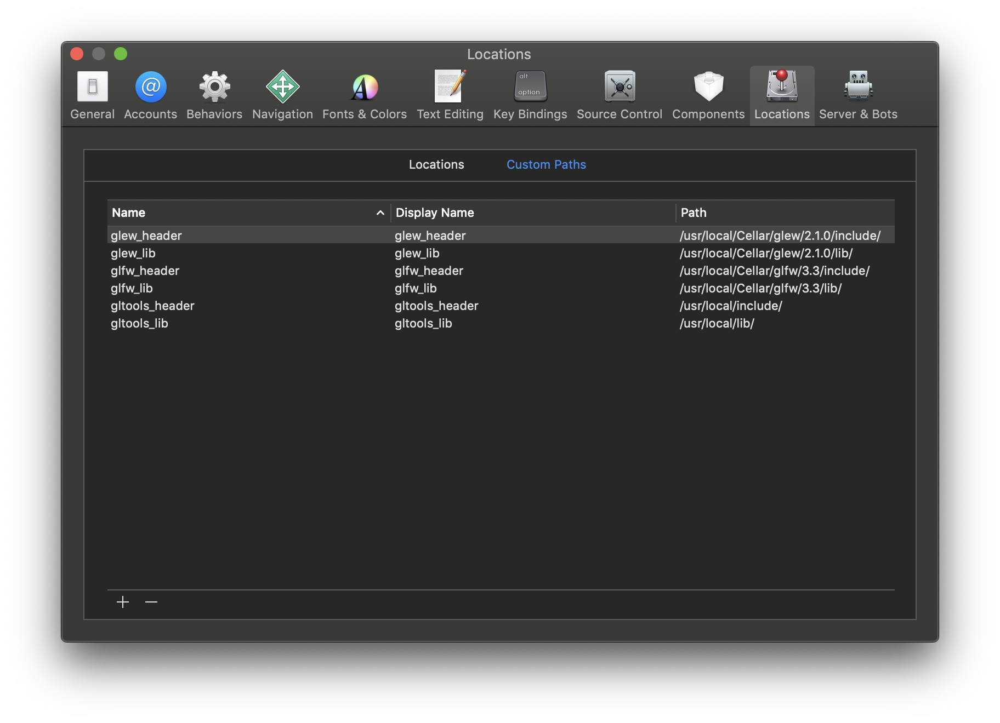
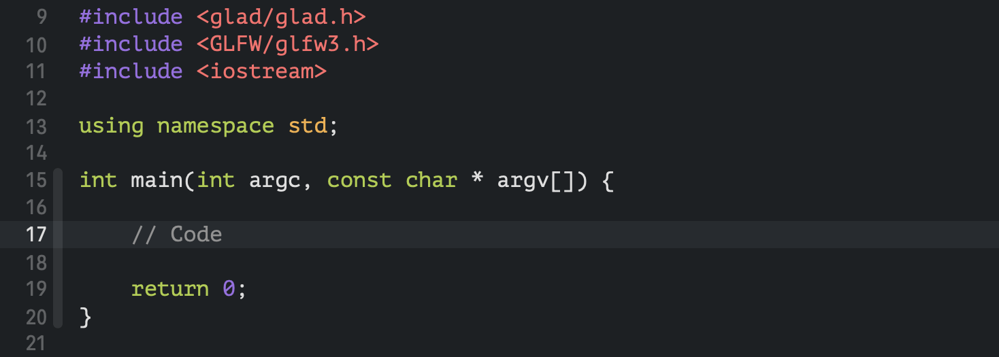

# Learn OpenGL

> My demos and exercises following the [LearnOpenGL](https://learnopengl-cn.github.io) tutorial.

### Preparation

- ##### Environment Setup

  - **cmake** `brew install cmake`
  - **GLFW** `brew install glfw`
  - **GLEW** `brew install glew`
  - **GLAD** [DOWNLOAD HERE](https://glad.dav1d.de)
    - Language: `C/C++`
    - Specification: `OpenGL`
    - API:
      - gl: `Version 3.3`
    - Profile: `Core`
    - Options: `Generate a loader`
    - 单击 `Generate` 开始下载
    - 解压得到的glad.zip后打开里面GLAD把glad.c拖出来放到桌面，然后将GLAD和KHR两个文件夹放入 `/usr/local/include` 目录下

- ##### Project Settings

  - **Create**
    - `Create a new XCode project`
    - `Command Line Tool`
    - Language: `C++`
  - **Global Settings**
    
    - 
  - **Project Settings**
    - Build Settings
      - Add following arguments to `Header Search Paths`
        - `$(glew_header)`
        - `$(glfw_header)`
        - `$(gltools_header)`
      - Add following arguments to `Library Search Paths`
        - `$(glew_header)`
        - `$(glfw_header)`
        - `$(gltools_header)`
      
    - Build Phases
      - Add following libraries to `Link Binary With Libraries`
        - `OpenGL.framework` 直接选择
        - `libglfw.3.3.dylib` 通过 `Add Other...` 搜索添加
        - `libGLEW.2.1.0.dylib` 通过 `Add Other...` 搜索添加
      
    - 将glad.c拖入main.cpp所在的目录，选择 `Copy items if needed` ，其它保持默认
    
    - Header Include
    
      - 在main.cpp的头部导入头文件 `<glad/glad.h>` 和 `<GLFW/glfw3.h>` ，注意glad应放在第一个。如下
    
        

